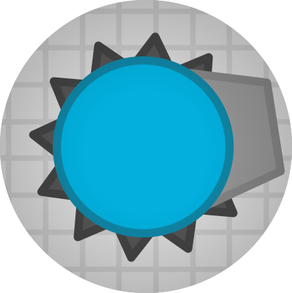

<br><br>
<div align="center">

<h3> diep custom </h3>
<p> An open source diep.io custom private-server template </p>
</div>
<br>

## Running backend

Run the server with:
```bash
$ npm run server
```
This builds and runs the server.

After running the server, content will be served at `localhost:8080` on your computer. The port will default to 8080, and you may override it with `process.env.PORT`.

Consult `src/config.ts` for configuration, and `package.json` for environ variable setup.

## Discord Chat

For support or discussion, please join our [online Discord chat](https://discord.gg/SyxWdxgHnT).


## Contribution

Please see [CONTRIBUTING.md](./CONTRIBUTING.md) for information on contributing.

<!-- OLD TEXT, saving here just for now
  All issues should be relate to critical bugs, stat related inconsistencies, or undefined/misdefined behavior.

  ### Pull Requests

  When making a pull request, please indicate whether you are either:
    1. Patching an issue documented in Issues
    2. Fixing a documentation related error (grammar, syntax, etc in markdown or comments)
    
  If the reason for your pull request differs from these two, then summarize both the issue and the changes you made.
-->

## License

Please see [LICENSE](./LICENSE)
